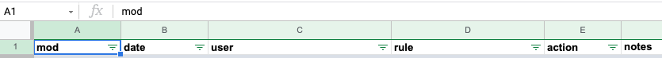
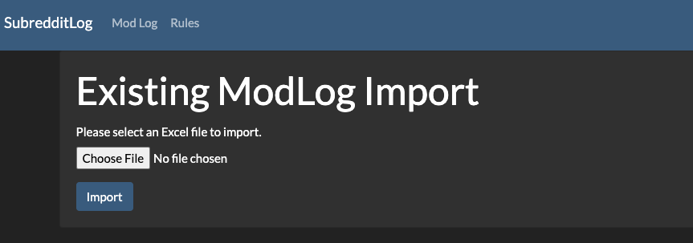
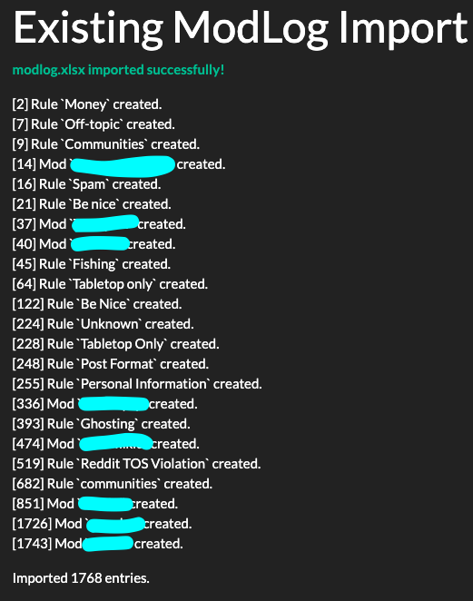
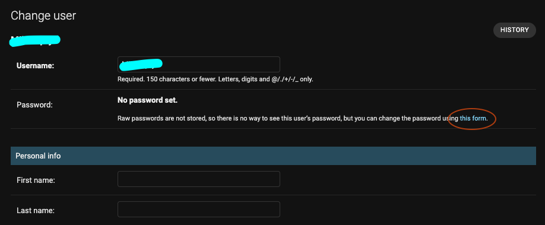
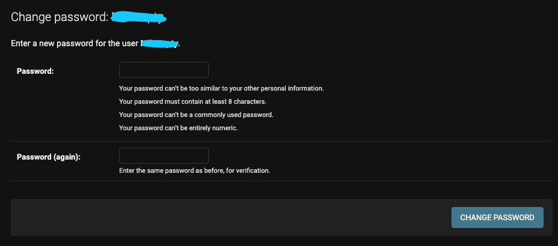

# Initial Configuration

After logging in with your super user account, head over to the admin panel, which is available by navigating to 
`/admin`, for example https://subredditlog.example.com/admin, or clicking the 'Admin' link in the navbar. You should see 
a screen like this:

## Site Configuration

Your SubredditLog installation can be configured by clicking on "Config" in the "Constance" section. Here, you can 
configure the name of your subreddit and whether you want the modlog to be publicly accessible.

Add your subreddit's name, uncheck the box next to PUBLIC_MODLOG if you want it to be private, and click Save.

## Setting the Rules

Your subreddit has rules, so they need to be defined here, too.

In the admin panel, under Entries, click on Rules. Here, you can add, edit, and order rules to match your subreddit.

To add a rule, click the Add Rule button in the top right corner.

Enter the title and description of your rule, then click Save.

### Reordering Rules

You can reorder rules to match your subreddit's rule order by clicking on the arrows to the right of the rules.

### Editing and Deleting Rules

Rules can be edited by clicking on the Order Number of the rule.

Rules can be deleted by checking the box next to the rule, then selecting "Delete selected rules" from the action box
and clicking "Go".

## Fellow Moderators

Your fellow moderators need accounts, so let's create them. Click on "Users" then click "Add User" in the top right.

!!! info Please note that only moderators should have accounts, as anyone with an account can submit new moderator actions.

Enter the moderator's Reddit username and give them a temporary password (you can use [NuPass](https://nupass.pw) to 
generate easy to read temporary passwords). You can then privately message these credentials to the mod.

### Making Other Super Users

By default, the new accounts created for your mods will not be able to access the admin panel, so cannot edit actions or
update the Site Configuration. If you'd like them to be able to do so, you'll need to be enable Staff and Superuser
status for the account.

The edit user screen is displayed after creating a user, but can also be reached by clicking on the user's name in the 
Users screen.

Check both boxes, scroll down, and click Save.

## Importing an Existing Modlog

If you have an existing mod log stored somewhere, SubredditLog can import it in Excel format (.xlsx). 

!!! warning This can only be done prior to manually adding entries. If there are existing entries in SubredditLog, this process won't work.

Prior to importation, please ensure that the Excel file is in the following format:

Also, please sanitize the file. Moderators and rules will be automatically created based on the contents of this file,
so ensure that:

- Moderator names are capitalized correctly. 
  - Moderator123 and moderator123 will be seen as different moderators.
- Rule names are uniform.
  - Capitalization is important.
  - "Racism" and "No Racism" would be seen as different rules, as would "Communities" and "communities."

### Perform the Import

After completing "Site Configuration" above, navigate to `/import`.

Click on "Choose File" and select your properly-formatted, sanitized Excel file. Then, click on "Import".

The process may take a moment, but will notify you of any errors as well as created rules, moderators, and the number of
imported log entries.

As you can see in the screenshot, the import ran without issue. However, those particularly observant will notice that,
on line 682, an additional "communities" rule was created due to a capitalization issue.

### Set Passwords for Fellow Moderators

The Import will have created accounts for your fellow moderators, but those accounts do not have passwords set, so they
cannot be used to log in. You will need to navigate to the admin area again (`/admin` or click the 'Admin' link in the 
navbar) and then clicking on Users in the Accounts section.

Click on the username of the moderator for which you'd like to set a password and you'll be presented with the 'Change 
user' screen, as seen below.

As you can see, they don't have a password set, but you can set the password by clicking on the link which is circled in
orange in the screenshot above. This will take you to the 'Change password' screen.

Give them a temporary password (you can use [NuPass](https://nupass.pw) to generate easy to read temporary passwords) 
by entering it twice. Then privately message these credentials to the mod.

Repeat for each moderator who will need access to the modlog.
