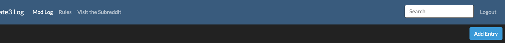
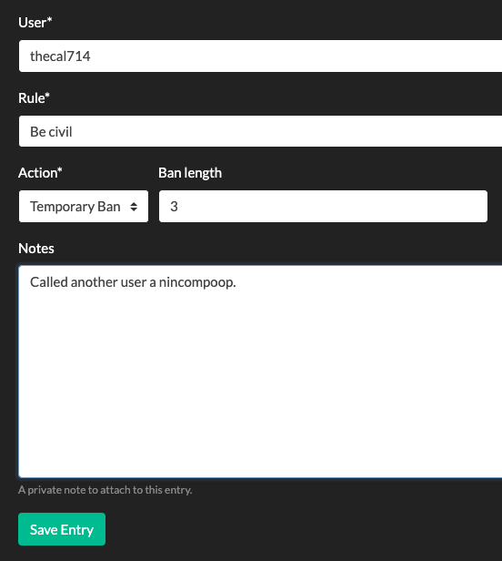

# Moderator Tasks

## Adding Moderator Actions

Once logged in, an "Add Entry" button should be visible at the top-right of the mod log.

Clicking this will take you to the Add Entry form.

Here you can fill in:

- the username of the user against which action was taken,
- the rule which the user violated,
- the action taken,
  - warning
  - temporary ban (don't forget to fill in the length of the ban)
  - permanent ban
- and notes.
  - Notes are only visible by fellow moderators and are not part of the public modlog

Save the entry and it will be added to the top of the modlog.

## Search the Log

Using the search bar at the top of the page, you can search for usernames or for items in the 'notes' field.

Press Enter to conduct your search.
